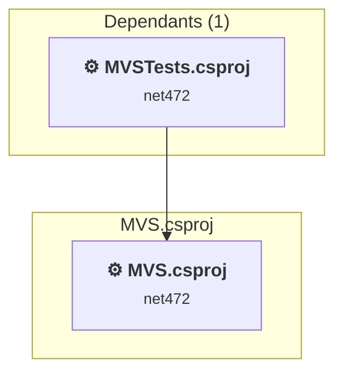
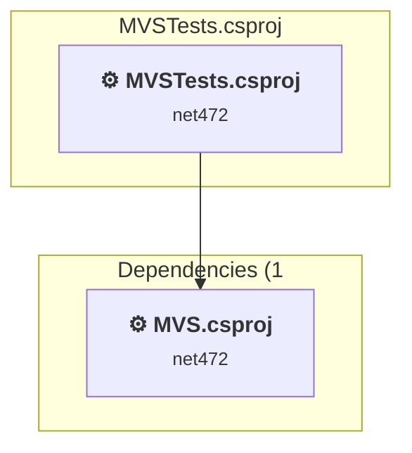

# Projects and dependencies analysis

This document provides a comprehensive overview of the projects and their dependencies in the context of upgrading to .NETCoreApp,Version=v10.0.

## Table of Contents

- [Executive Summary](#executive-Summary)
  - [Highlevel Metrics](#highlevel-metrics)
  - [Projects Compatibility](#projects-compatibility)
  - [Package Compatibility](#package-compatibility)
  - [API Compatibility](#api-compatibility)
- [Aggregate NuGet packages details](#aggregate-nuget-packages-details)
- [Top API Migration Challenges](#top-api-migration-challenges)
  - [Technologies and Features](#technologies-and-features)
  - [Most Frequent API Issues](#most-frequent-api-issues)
- [Projects Relationship Graph](#projects-relationship-graph)
- [Project Details](#project-details)

  - [MVS\MVS.csproj](#mvsmvscsproj)
  - [MVSTests\MVSTests.csproj](#mvstestsmvstestscsproj)

## Executive Summary

### Highlevel Metrics

| Metric | Count | Status |
| :--- | :---: | :--- |
| Total Projects | 3 | All require upgrade |
| Total NuGet Packages | 76 | 9 need upgrade |
| Total Code Files | 134 |  |
| Total Code Files with Incidents | 96 |  |
| Total Lines of Code | 29839 |  |
| Total Number of Issues | 6673 |  |
| Estimated LOC to modify | 6613+ | at least 22,2% of codebase |

### Projects Compatibility

| Project | Target Framework | Difficulty | Package Issues | API Issues | Est. LOC Impact | Description |
| :--- | :---: | :---: | :---: | :---: | :---: | :--- |
| [MVS\MVS.csproj](#mvsmvscsproj) | net472 | 🟡 Medium | 46 | 6334 | 6334+ | ClassicWinForms, Sdk Style = False |
| [MVSTests\MVSTests.csproj](#mvstestsmvstestscsproj) | net472 | 🟡 Medium | 10 | 279 | 279+ | ClassicWpf, Sdk Style = False |

### Package Compatibility

| Status | Count | Percentage |
| :--- | :---: | :---: |
| ✅ Compatible | 67 | 88,2% |
| ⚠️ Incompatible | 2 | 2,6% |
| 🔄 Upgrade Recommended | 7 | 9,2% |
| ***Total NuGet Packages*** | ***76*** | ***100%*** |

### API Compatibility

| Category | Count | Impact |
| :--- | :---: | :--- |
| 🔴 Binary Incompatible | 5449 | High - Require code changes |
| 🟡 Source Incompatible | 1124 | Medium - Needs re-compilation and potential conflicting API error fixing |
| 🔵 Behavioral change | 40 | Low - Behavioral changes that may require testing at runtime |
| ✅ Compatible | 25868 |  |
| ***Total APIs Analyzed*** | ***32481*** |  |

## Aggregate NuGet packages details

| Package | Current Version | Suggested Version | Projects | Description |
| :--- | :---: | :---: | :--- | :--- |
| CrcDotNET | 1.0.3 |  | [MVS.csproj](#mvsmvscsproj) | ✅Compatible |
| DeviceId.Windows.Wmi | 6.8.0 |  | [MVS.csproj](#mvsmvscsproj) | ✅Compatible |
| Google.Protobuf | 3.29.3 |  | [MVS.csproj](#mvsmvscsproj) | ✅Compatible |
| K4os.Compression.LZ4.Streams | 1.3.8 |  | [MVS.csproj](#mvsmvscsproj) | ✅Compatible |
| MathNet.Numerics | 5.0.0 |  | [MVS.csproj](#mvsmvscsproj) | ✅Compatible |
| MIConvexHull | 1.1.19.1019 |  | [MVS.csproj](#mvsmvscsproj) | ✅Compatible |
| Microsoft.ApplicationInsights | 2.22.0 |  | [MVSTests.csproj](#mvstestsmvstestscsproj) | ⚠️NuGet package is deprecated |
| Microsoft.NETCore.Platforms | 7.0.4 |  | [MVS.csproj](#mvsmvscsproj) | NuGet package functionality is included with framework reference |
| Microsoft.Testing.Extensions.Telemetry | 1.5.3 |  | [MVSTests.csproj](#mvstestsmvstestscsproj) | ✅Compatible |
| Microsoft.Testing.Extensions.TrxReport.Abstractions | 1.5.3 |  | [MVSTests.csproj](#mvstestsmvstestscsproj) | ✅Compatible |
| Microsoft.Testing.Extensions.VSTestBridge | 1.5.3 |  | [MVSTests.csproj](#mvstestsmvstestscsproj) | ✅Compatible |
| Microsoft.Testing.Platform | 1.5.3 |  | [MVSTests.csproj](#mvstestsmvstestscsproj) | ✅Compatible |
| Microsoft.Testing.Platform.MSBuild | 1.5.3 |  | [MVSTests.csproj](#mvstestsmvstestscsproj) | ✅Compatible |
| Microsoft.TestPlatform.ObjectModel | 17.13.0 |  | [MVSTests.csproj](#mvstestsmvstestscsproj) | ✅Compatible |
| Microsoft.Win32.Primitives | 4.3.0 |  | [MVS.csproj](#mvsmvscsproj) | NuGet package functionality is included with framework reference |
| Microsoft.Xaml.Behaviors.Wpf | 1.1.135 | 1.1.39 | [MVS.csproj](#mvsmvscsproj) | ⚠️NuGet package is incompatible |
| MSTest.Analyzers | 3.7.3 |  | [MVSTests.csproj](#mvstestsmvstestscsproj) | ✅Compatible |
| MSTest.TestAdapter | 3.7.3 |  | [MVSTests.csproj](#mvstestsmvstestscsproj) | ✅Compatible |
| MSTest.TestFramework | 3.7.3 |  | [MVSTests.csproj](#mvstestsmvstestscsproj) | ✅Compatible |
| MySql.Data | 9.2.0 |  | [MVS.csproj](#mvsmvscsproj) | ✅Compatible |
| MySqlConnector | 2.4.0 |  | [MVS.csproj](#mvsmvscsproj) | ✅Compatible |
| NETStandard.Library | 2.0.3 |  | [MVS.csproj](#mvsmvscsproj) | NuGet package functionality is included with framework reference |
| NModbus.Serial | 3.0.81 |  | [MVS.csproj](#mvsmvscsproj) | ✅Compatible |
| Portable.BouncyCastle | 1.9.0 |  | [MVS.csproj](#mvsmvscsproj) | ✅Compatible |
| System.AppContext | 4.3.0 |  | [MVS.csproj](#mvsmvscsproj) | NuGet package functionality is included with framework reference |
| System.Buffers | 4.6.0 |  | [MVSTests.csproj](#mvstestsmvstestscsproj) | NuGet package functionality is included with framework reference |
| System.Collections | 4.3.0 |  | [MVS.csproj](#mvsmvscsproj) | NuGet package functionality is included with framework reference |
| System.Collections.Concurrent | 4.3.0 |  | [MVS.csproj](#mvsmvscsproj) | NuGet package functionality is included with framework reference |
| System.Collections.Immutable | 9.0.1 | 10.0.8 | [MVS.csproj](#mvsmvscsproj) [MVSTests.csproj](#mvstestsmvstestscsproj) | NuGet package upgrade is recommended |
| System.Configuration.ConfigurationManager | 9.0.1 | 10.0.8 | [MVS.csproj](#mvsmvscsproj) | NuGet package upgrade is recommended |
| System.Console | 4.3.1 |  | [MVS.csproj](#mvsmvscsproj) | NuGet package functionality is included with framework reference |
| System.Diagnostics.Debug | 4.3.0 |  | [MVS.csproj](#mvsmvscsproj) | NuGet package functionality is included with framework reference |
| System.Diagnostics.DiagnosticSource | 9.0.1 | 10.0.8 | [MVSTests.csproj](#mvstestsmvstestscsproj) | NuGet package upgrade is recommended |
| System.Diagnostics.Tools | 4.3.0 |  | [MVS.csproj](#mvsmvscsproj) | NuGet package functionality is included with framework reference |
| System.Diagnostics.Tracing | 4.3.0 |  | [MVS.csproj](#mvsmvscsproj) | NuGet package functionality is included with framework reference |
| System.Globalization | 4.3.0 |  | [MVS.csproj](#mvsmvscsproj) | NuGet package functionality is included with framework reference |
| System.Globalization.Calendars | 4.3.0 |  | [MVS.csproj](#mvsmvscsproj) | NuGet package functionality is included with framework reference |
| System.IO.Compression | 4.3.0 |  | [MVS.csproj](#mvsmvscsproj) | NuGet package functionality is included with framework reference |
| System.IO.Compression.ZipFile | 4.3.0 |  | [MVS.csproj](#mvsmvscsproj) | NuGet package functionality is included with framework reference |
| System.IO.FileSystem | 4.3.0 |  | [MVS.csproj](#mvsmvscsproj) | NuGet package functionality is included with framework reference |
| System.IO.Pipelines | 9.0.1 | 10.0.8 | [MVS.csproj](#mvsmvscsproj) | NuGet package upgrade is recommended |
| System.Linq | 4.3.0 |  | [MVS.csproj](#mvsmvscsproj) | NuGet package functionality is included with framework reference |
| System.Linq.Expressions | 4.3.0 |  | [MVS.csproj](#mvsmvscsproj) | NuGet package functionality is included with framework reference |
| System.Memory | 4.6.0 |  | [MVSTests.csproj](#mvstestsmvstestscsproj) | NuGet package functionality is included with framework reference |
| System.Net.Http | 4.3.4 |  | [MVS.csproj](#mvsmvscsproj) | NuGet package functionality is included with framework reference |
| System.Net.Primitives | 4.3.1 |  | [MVS.csproj](#mvsmvscsproj) | NuGet package functionality is included with framework reference |
| System.Net.Sockets | 4.3.0 |  | [MVS.csproj](#mvsmvscsproj) | NuGet package functionality is included with framework reference |
| System.Numerics.Vectors | 4.6.0 |  | [MVSTests.csproj](#mvstestsmvstestscsproj) | NuGet package functionality is included with framework reference |
| System.ObjectModel | 4.3.0 |  | [MVS.csproj](#mvsmvscsproj) | NuGet package functionality is included with framework reference |
| System.Reflection | 4.3.0 |  | [MVS.csproj](#mvsmvscsproj) | NuGet package functionality is included with framework reference |
| System.Reflection.Extensions | 4.3.0 |  | [MVS.csproj](#mvsmvscsproj) | NuGet package functionality is included with framework reference |
| System.Reflection.Metadata | 9.0.1 | 10.0.8 | [MVSTests.csproj](#mvstestsmvstestscsproj) | NuGet package upgrade is recommended |
| System.Reflection.Primitives | 4.3.0 |  | [MVS.csproj](#mvsmvscsproj) | NuGet package functionality is included with framework reference |
| System.Resources.ResourceManager | 4.3.0 |  | [MVS.csproj](#mvsmvscsproj) | NuGet package functionality is included with framework reference |
| System.Runtime | 4.3.1 |  | [MVS.csproj](#mvsmvscsproj) | NuGet package functionality is included with framework reference |
| System.Runtime.CompilerServices.Unsafe | 6.1.0 | 6.1.2 | [MVSTests.csproj](#mvstestsmvstestscsproj) | NuGet package upgrade is recommended |
| System.Runtime.Extensions | 4.3.1 |  | [MVS.csproj](#mvsmvscsproj) | NuGet package functionality is included with framework reference |
| System.Runtime.Handles | 4.3.0 |  | [MVS.csproj](#mvsmvscsproj) | ✅Compatible |
| System.Runtime.InteropServices | 4.3.0 |  | [MVS.csproj](#mvsmvscsproj) | NuGet package functionality is included with framework reference |
| System.Runtime.InteropServices.RuntimeInformation | 4.3.0 |  | [MVS.csproj](#mvsmvscsproj) | NuGet package functionality is included with framework reference |
| System.Runtime.InteropServices.WindowsRuntime | 4.3.0 |  | [MVS.csproj](#mvsmvscsproj) | NuGet package functionality is included with framework reference |
| System.Runtime.Numerics | 4.3.0 |  | [MVS.csproj](#mvsmvscsproj) | NuGet package functionality is included with framework reference |
| System.Security.Cryptography.Algorithms | 4.3.1 |  | [MVS.csproj](#mvsmvscsproj) | NuGet package functionality is included with framework reference |
| System.Security.Cryptography.X509Certificates | 4.3.2 |  | [MVS.csproj](#mvsmvscsproj) | NuGet package functionality is included with framework reference |
| System.Text.Encoding | 4.3.0 |  | [MVS.csproj](#mvsmvscsproj) | NuGet package functionality is included with framework reference |
| System.Text.Encoding.Extensions | 4.3.0 |  | [MVS.csproj](#mvsmvscsproj) | NuGet package functionality is included with framework reference |
| System.Text.Json | 9.0.1 | 10.0.8 | [MVS.csproj](#mvsmvscsproj) | NuGet package upgrade is recommended |
| System.Text.RegularExpressions | 4.3.1 |  | [MVS.csproj](#mvsmvscsproj) | NuGet package functionality is included with framework reference |
| System.Threading | 4.3.0 |  | [MVS.csproj](#mvsmvscsproj) | NuGet package functionality is included with framework reference |
| System.Threading.Tasks | 4.3.0 |  | [MVS.csproj](#mvsmvscsproj) | NuGet package functionality is included with framework reference |
| System.Threading.Tasks.Extensions | 4.6.0 |  | [MVSTests.csproj](#mvstestsmvstestscsproj) | NuGet package functionality is included with framework reference |
| System.Threading.Timer | 4.3.0 |  | [MVS.csproj](#mvsmvscsproj) | NuGet package functionality is included with framework reference |
| System.Xml.ReaderWriter | 4.3.1 |  | [MVS.csproj](#mvsmvscsproj) [MVSTests.csproj](#mvstestsmvstestscsproj) | NuGet package functionality is included with framework reference |
| System.Xml.XDocument | 4.3.0 |  | [MVS.csproj](#mvsmvscsproj) | NuGet package functionality is included with framework reference |
| Telerik.Licensing | 1.8.2 |  | [MVS.csproj](#mvsmvscsproj) | ✅Compatible |
| ZstdSharp.Port | 0.8.4 |  | [MVS.csproj](#mvsmvscsproj) | ✅Compatible |

## Top API Migration Challenges

### Technologies and Features

| Technology | Issues | Percentage | Migration Path |
| :--- | :---: | :---: | :--- |
| WPF (Windows Presentation Foundation) | 3962 | 59,9% | WPF APIs for building Windows desktop applications with XAML-based UI that are available in .NET on Windows. WPF provides rich desktop UI capabilities with data binding and styling. Enable Windows Desktop support: Option 1 (Recommended): Target net9.0-windows; Option 2: Add <UseWindowsDesktop>true</UseWindowsDesktop>. |
| Legacy Configuration System | 732 | 11,1% | Legacy XML-based configuration system (app.config/web.config) that has been replaced by a more flexible configuration model in .NET Core. The old system was rigid and XML-based. Migrate to Microsoft.Extensions.Configuration with JSON/environment variables; use System.Configuration.ConfigurationManager NuGet package as interim bridge if needed. |
| GDI+ / System.Drawing | 28 | 0,4% | System.Drawing APIs for 2D graphics, imaging, and printing that are available via NuGet package System.Drawing.Common. Note: Not recommended for server scenarios due to Windows dependencies; consider cross-platform alternatives like SkiaSharp or ImageSharp for new code. |
| Windows Forms | 16 | 0,2% | Windows Forms APIs for building Windows desktop applications with traditional Forms-based UI that are available in .NET on Windows. Enable Windows Desktop support: Option 1 (Recommended): Target net9.0-windows; Option 2: Add <UseWindowsDesktop>true</UseWindowsDesktop>; Option 3 (Legacy): Use Microsoft.NET.Sdk.WindowsDesktop SDK. |

### Most Frequent API Issues

| API | Count | Percentage | Category |
| :--- | :---: | :---: | :--- |
| T:System.Windows.Visibility | 345 | 5,2% | Binary Incompatible |
| T:System.Windows.Controls.TextBox | 330 | 5,0% | Binary Incompatible |
| T:System.Windows.Controls.Label | 274 | 4,1% | Binary Incompatible |
| T:System.Windows.RoutedEventHandler | 220 | 3,3% | Binary Incompatible |
| P:System.Configuration.ConfigurationElement.Item(System.String) | 178 | 2,7% | Source Incompatible |
| T:System.Windows.Input.Key | 171 | 2,6% | Binary Incompatible |
| P:System.Windows.UIElement.IsEnabled | 162 | 2,4% | Binary Incompatible |
| T:System.Windows.Controls.Button | 151 | 2,3% | Binary Incompatible |
| P:System.Windows.Controls.TextBox.Text | 139 | 2,1% | Binary Incompatible |
| T:System.Windows.Threading.DispatcherTimer | 112 | 1,7% | Binary Incompatible |
| T:System.Windows.Input.KeyEventHandler | 110 | 1,7% | Binary Incompatible |
| T:System.Windows.RoutedEventArgs | 106 | 1,6% | Binary Incompatible |
| P:System.Windows.UIElement.Visibility | 103 | 1,6% | Binary Incompatible |
| T:System.Windows.Media.Media3D.Vector3D | 97 | 1,5% | Binary Incompatible |
| P:System.Windows.Controls.ContentControl.Content | 93 | 1,4% | Binary Incompatible |
| T:System.Windows.Controls.ItemCollection | 92 | 1,4% | Binary Incompatible |
| P:System.Windows.Controls.ItemsControl.Items | 92 | 1,4% | Binary Incompatible |
| T:System.Windows.Application | 89 | 1,3% | Binary Incompatible |
| M:System.Configuration.ConfigurationPropertyAttribute.#ctor(System.String) | 89 | 1,3% | Source Incompatible |
| T:System.Configuration.ConfigurationPropertyAttribute | 89 | 1,3% | Source Incompatible |
| T:System.Windows.Media.Media3D.ModelVisual3D | 88 | 1,3% | Binary Incompatible |
| M:System.Windows.Controls.ItemCollection.Add(System.Object) | 87 | 1,3% | Binary Incompatible |
| M:System.Windows.Media.Int32Collection.Add(System.Int32) | 81 | 1,2% | Binary Incompatible |
| T:System.Windows.Controls.TextBlock | 70 | 1,1% | Binary Incompatible |
| T:System.Windows.Controls.SelectionChangedEventHandler | 68 | 1,0% | Binary Incompatible |
| F:System.Windows.Visibility.Collapsed | 64 | 1,0% | Binary Incompatible |
| T:System.Windows.Media.Media3D.Point3D | 58 | 0,9% | Binary Incompatible |
| T:System.Windows.Controls.DockPanel | 58 | 0,9% | Binary Incompatible |
| T:System.Windows.Input.KeyEventArgs | 57 | 0,9% | Binary Incompatible |
| T:System.Windows.Input.Keyboard | 57 | 0,9% | Binary Incompatible |
| M:System.Windows.Input.Keyboard.ClearFocus | 57 | 0,9% | Binary Incompatible |
| F:System.Windows.Input.Key.Return | 57 | 0,9% | Binary Incompatible |
| P:System.Windows.Input.KeyEventArgs.Key | 57 | 0,9% | Binary Incompatible |
| E:System.Windows.UIElement.KeyDown | 55 | 0,8% | Binary Incompatible |
| E:System.Windows.UIElement.LostFocus | 55 | 0,8% | Binary Incompatible |
| T:System.IO.Ports.Handshake | 52 | 0,8% | Source Incompatible |
| T:System.IO.Ports.Parity | 52 | 0,8% | Source Incompatible |
| T:System.IO.Ports.StopBits | 52 | 0,8% | Source Incompatible |
| T:System.IO.Ports.SerialPort | 51 | 0,8% | Source Incompatible |
| T:System.Windows.Threading.DispatcherPriority | 50 | 0,8% | Binary Incompatible |
| T:System.Windows.Media.Color | 46 | 0,7% | Binary Incompatible |
| E:System.Windows.Controls.Primitives.ButtonBase.Click | 45 | 0,7% | Binary Incompatible |
| T:System.Configuration.Configuration | 45 | 0,7% | Source Incompatible |
| T:System.Windows.Media.Media3D.MeshGeometry3D | 44 | 0,7% | Binary Incompatible |
| T:System.Windows.Media.Media3D.Material | 43 | 0,7% | Binary Incompatible |
| T:System.Windows.Media.Media3D.PerspectiveCamera | 41 | 0,6% | Binary Incompatible |
| F:System.Windows.Visibility.Visible | 41 | 0,6% | Binary Incompatible |
| M:System.Windows.Media.Media3D.Point3D.#ctor(System.Double,System.Double,System.Double) | 36 | 0,5% | Binary Incompatible |
| P:System.Windows.Controls.Primitives.Selector.SelectedIndex | 35 | 0,5% | Binary Incompatible |
| T:System.Windows.Controls.CheckBox | 35 | 0,5% | Binary Incompatible |

## Projects Relationship Graph

Legend:
📦 SDK-style project
⚙️ Classic project

## Project Details

### MVS\MVS.csproj

#### Project Info

- **Current Target Framework:** net472
- **Proposed Target Framework:** net10.0-windows
- **SDK-style**: False
- **Project Kind:** ClassicWinForms
- **Dependencies**: 0
- **Dependants**: 1
- **Number of Files**: 120
- **Number of Files with Incidents**: 89
- **Lines of Code**: 28339
- **Estimated LOC to modify**: 6334+ (at least 22,4% of the project)

#### Dependency Graph

Legend:
📦 SDK-style project
⚙️ Classic project

### API Compatibility

| Category | Count | Impact |
| :--- | :---: | :--- |
| 🔴 Binary Incompatible | 5170 | High - Require code changes |
| 🟡 Source Incompatible | 1124 | Medium - Needs re-compilation and potential conflicting API error fixing |
| 🔵 Behavioral change | 40 | Low - Behavioral changes that may require testing at runtime |
| ✅ Compatible | 24062 |  |
| ***Total APIs Analyzed*** | ***30396*** |  |

#### Project Technologies and Features

| Technology | Issues | Percentage | Migration Path |
| :--- | :---: | :---: | :--- |
| GDI+ / System.Drawing | 28 | 0,4% | System.Drawing APIs for 2D graphics, imaging, and printing that are available via NuGet package System.Drawing.Common. Note: Not recommended for server scenarios due to Windows dependencies; consider cross-platform alternatives like SkiaSharp or ImageSharp for new code. |
| Windows Forms | 16 | 0,3% | Windows Forms APIs for building Windows desktop applications with traditional Forms-based UI that are available in .NET on Windows. Enable Windows Desktop support: Option 1 (Recommended): Target net9.0-windows; Option 2: Add <UseWindowsDesktop>true</UseWindowsDesktop>; Option 3 (Legacy): Use Microsoft.NET.Sdk.WindowsDesktop SDK. |
| WPF (Windows Presentation Foundation) | 3687 | 58,2% | WPF APIs for building Windows desktop applications with XAML-based UI that are available in .NET on Windows. WPF provides rich desktop UI capabilities with data binding and styling. Enable Windows Desktop support: Option 1 (Recommended): Target net9.0-windows; Option 2: Add <UseWindowsDesktop>true</UseWindowsDesktop>. |
| Legacy Configuration System | 732 | 11,6% | Legacy XML-based configuration system (app.config/web.config) that has been replaced by a more flexible configuration model in .NET Core. The old system was rigid and XML-based. Migrate to Microsoft.Extensions.Configuration with JSON/environment variables; use System.Configuration.ConfigurationManager NuGet package as interim bridge if needed. |

### MVSTests\MVSTests.csproj

#### Project Info

- **Current Target Framework:** net472
- **Proposed Target Framework:** net10.0-windows
- **SDK-style**: False
- **Project Kind:** ClassicWpf
- **Dependencies**: 1
- **Dependants**: 0
- **Number of Files**: 17
- **Number of Files with Incidents**: 7
- **Lines of Code**: 1500
- **Estimated LOC to modify**: 279+ (at least 18,6% of the project)

#### Dependency Graph

Legend:
📦 SDK-style project
⚙️ Classic project

### API Compatibility

| Category | Count | Impact |
| :--- | :---: | :--- |
| 🔴 Binary Incompatible | 279 | High - Require code changes |
| 🟡 Source Incompatible | 0 | Medium - Needs re-compilation and potential conflicting API error fixing |
| 🔵 Behavioral change | 0 | Low - Behavioral changes that may require testing at runtime |
| ✅ Compatible | 1806 |  |
| ***Total APIs Analyzed*** | ***2085*** |  |

#### Project Technologies and Features

| Technology | Issues | Percentage | Migration Path |
| :--- | :---: | :---: | :--- |
| WPF (Windows Presentation Foundation) | 275 | 98,6% | WPF APIs for building Windows desktop applications with XAML-based UI that are available in .NET on Windows. WPF provides rich desktop UI capabilities with data binding and styling. Enable Windows Desktop support: Option 1 (Recommended): Target net9.0-windows; Option 2: Add <UseWindowsDesktop>true</UseWindowsDesktop>. |

